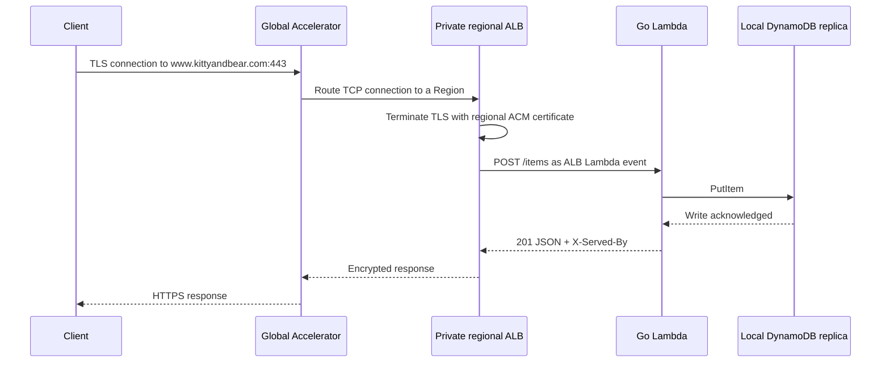
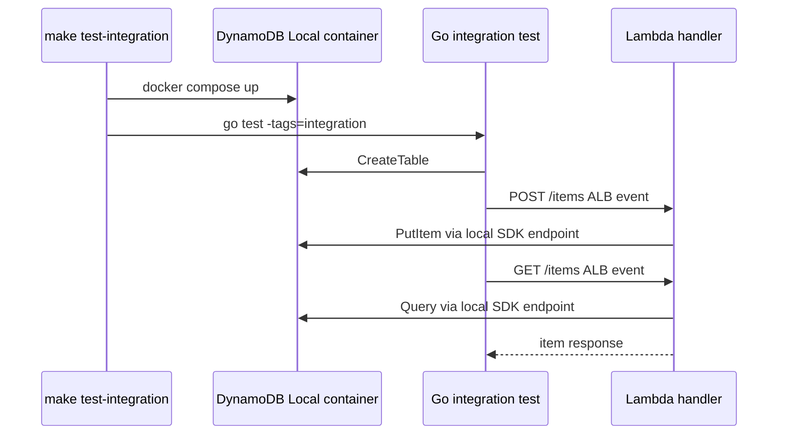

# Architecture

## Milestone 1: make it work

The current milestone establishes a reproducible build and a writable two-Region backend. Automated failover and failback validation are intentionally deferred.

```mermaid
flowchart LR
    Client[Client] -. resolves www.kittyandbear.com .-> DNS[External authoritative DNS]
    Client -->|TLS over TCP/443| GA[Global Accelerator]
    GA -->|TCP/443| ALBW[Private ALB HTTPS/443<br/>us-west-2]
    GA -->|TCP/443| ALBE[Private ALB HTTPS/443<br/>us-east-1]
    ALBW --> LW[Go Lambda]
    ALBE --> LE[Go Lambda]
    LW --> DW[(DynamoDB replica<br/>us-west-2)]
    LE --> DE[(DynamoDB replica<br/>us-east-1)]
    DW <-->|MRSC replication| DE
    DW --- W[Witness<br/>us-east-2]
    DE --- W
```

Each regional VPC contains isolated subnets and an internal Application Load Balancer. An internet gateway is attached to each VPC because Global Accelerator requires it for private ALB endpoints, but the isolated subnets have no route to that gateway and the ALBs have no public addresses. Global Accelerator is the only public network entry point.

The accelerator accepts TCP/443 and preserves TLS until the selected regional ALB. Each ALB terminates TLS with its regional ACM wildcard certificate for `*.kittyandbear.com`, which covers `www.kittyandbear.com`, using a policy that supports TLS 1.2 and 1.3. The ALB then invokes Lambda directly through the Lambda service; the Lambda function is not attached to the VPC.

The authoritative DNS zone for `kittyandbear.com` is not in Route 53 in the deployment account. A `www.kittyandbear.com` CNAME pointing to the accelerator hostname is therefore an external prerequisite managed at the current DNS provider.

The primary/secondary labels currently describe CloudFormation ownership and deployment order. Both DynamoDB replicas accept reads and writes.

## Write journey



## Deployment

1. Build the Linux ARM64 Lambda bootstrap binary.
2. Deploy `Svc-usw2` and `Svc-use1`.
3. Read the private `us-east-1` ALB ARN from the regional stack output.
4. Deploy `Svc-edge` with both private ALBs as Global Accelerator endpoints.
5. Point the external `www.kittyandbear.com` CNAME record to Global Accelerator.

All AWS infrastructure is declared in `infra/main.go`. The Makefile builds artifacts, supplies the two existing regional certificate ARNs, invokes CDK, and passes the secondary stack output into the edge deployment. The DNS record remains managed by the domain's external authoritative provider.

## Local integration journey

DynamoDB Local is a development dependency, not part of the deployed system. It exercises the Lambda handler and AWS SDK serialization against an actual DynamoDB-compatible server. It does not model multiple Regions, MRSC, IAM, ALB networking, or Global Accelerator.


