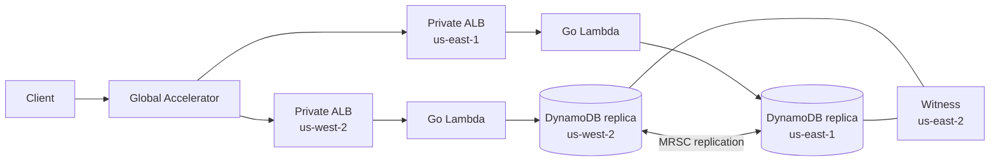
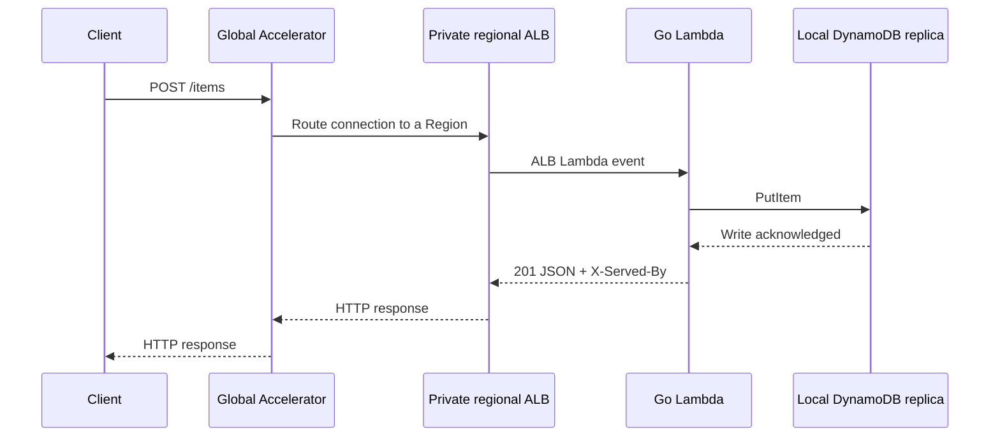

# Architecture

## Milestone 1: make it work

The current milestone establishes a reproducible build and a writable two-Region backend. Automated failover and failback validation are intentionally deferred.

Each regional VPC contains isolated subnets and an internal Application Load Balancer. The Lambda function is not attached to the VPC; the ALB invokes it through the Lambda service. Global Accelerator is the only public network entry point.

The primary/secondary labels currently describe CloudFormation ownership and deployment order. Both DynamoDB replicas accept reads and writes.

## Write journey

## Deployment

1. Build the Linux ARM64 Lambda bootstrap binary.
2. Deploy `Svc-usw2` and `Svc-use1`.
3. Read the private `us-east-1` ALB ARN from the regional stack output.
4. Deploy `Svc-edge` with both private ALBs as Global Accelerator endpoints.

All persistent infrastructure is declared in `infra/main.go`. The Makefile only builds artifacts, invokes CDK, and passes the secondary stack output into the edge deployment.
